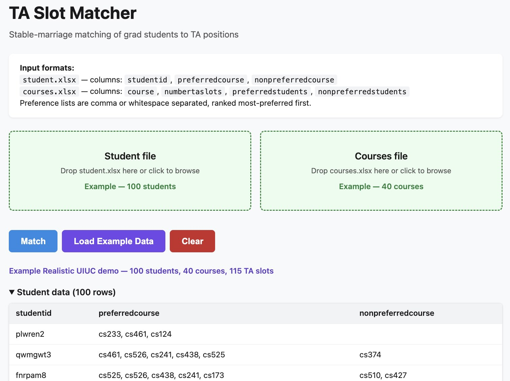

# TA Slot Matcher



Matching grad students to TA positions is a recurring headache for large departments. Students have course preferences; courses (instructors) have student preferences.

This demonstration tool automates the process using a variant of the **Gale-Shapley stable marriage algorithm** (specifically, the hospital-resident formulation). Both students and courses rank each other, and the algorithm finds a stable matching — one where no unmatched student-course pair would both prefer each other over their current assignment. The github repo contains example data, and implementation in python and javascript that can read Excel files. 

This tool is deliberately simplified for discussion and demonstration purposes.

The live version is at https://angrave.github.io/Auto-Match-Students-To-Course-TAships/

Each match gets a **combined score** (-200 to +200) so coordinators can review the result and spot cases that need manual adjustment before finalizing.

## How it works

### Input files

**student.xlsx** — one row per student:

| studentid | preferredcourse | nonpreferredcourse |
|-----------|----------------|--------------------|
| Alice     | CS101, CS201   | CS301              |
| Bob       | CS201          |                    |

**courses.xlsx** — one row per course:

| course | numbertaslots | preferredstudents | nonpreferredstudents |
|--------|--------------|-------------------|----------------------|
| CS101  | 2            | Alice, Carol      | Dave                 |
| CS201  | 1            | Bob               |                      |

Items in the preference columns are **comma or whitespace separated** and **ranked most-preferred first**.

### Output file

**draftmatch.xlsx** — one row per assignment:

| student | course | combinedscore |
|---------|--------|---------------|
| Alice   | CS101  | 200           |
| todo    | CS201  | 0             |
| Bob     | CS00   | 0             |

- If there are **more students than TA slots**, unmatched students are assigned to a placeholder course **CS00**.
- If there are **more slots than students**, unfilled positions show **"todo"** as the student name.

### Scoring

Each side scores the other independently on a scale from -100 to +100:

- **Preferred list**: rank 1 = 100, last rank = 1 (evenly spaced)
- **Nonpreferred list**: rank 1 = -100, last rank = -1 (evenly spaced)
- **Not mentioned**: 0

The **combined score** is the sum of both sides (range: -200 to +200). Higher is a better mutual fit.

## Installation

### 1. Install Python

Download and install Python 3.10 or later from [python.org](https://www.python.org/downloads/). During installation on Windows, check **"Add Python to PATH"**.

Verify it works:

```
python --version
```

### 2. Install uv (recommended package manager)

In a Windows PowerShell or Command Prompt:

```
powershell -ExecutionPolicy ByPass -c "irm https://astral.sh/uv/install.ps1 | iex"
```

On macOS/Linux:

```
curl -LsSf https://astral.sh/uv/install.sh | sh
```

### 3. Install dependencies

```
uv pip install pandas openpyxl
```

Or with standard pip:

```
pip install pandas openpyxl
```

## Usage

Place your `student.xlsx` and `courses.xlsx` in the working directory, then run:

```
python tamatch.py
```

This reads the default filenames and writes `draftmatch.xlsx`.

To specify custom filenames:

```
python tamatch.py my_students.xlsx my_courses.xlsx my_output.xlsx
```

Any other number of arguments prints a usage message and exits.

## Running the tests

### 1. Generate test data

```
python testdata/create_tests.py
```

This creates 12 pairs of input/expected-output `.xlsx` files in `testdata/`.

### 2. Run the test suite

```
python testdata/run_tests.py
```

The runner executes `tamatch.py` against each test case and compares the actual output to the expected output (sorted by course and student, so row order doesn't matter).

### Test cases

| Test | What it checks |
|------|---------------|
| t01_one_to_one | Simplest case — 1 student, 1 course, 1 slot |
| t02_perfect_match | Mutual first choices — everyone gets their top pick |
| t03_surplus_students | More students than slots — overflow goes to CS00 |
| t04_surplus_slots | More slots than students — unfilled slots show "todo" |
| t05_competing | Two students want the same slot — course preference breaks the tie |
| t06_nonpreferred | Student avoids a course they marked as nonpreferred |
| t07_no_prefs | No preferences at all — everything scores 0, everyone still gets placed |
| t08_multi_slot | One course with multiple slots and ranked student preferences |
| t09_displacement | Displacement chain — student bumped from first choice can't displace from second, goes to CS00 |
| t10_ranked | Correct scoring across a ranked list of 3 preferred courses |
| t11_parsing | Mixed comma and whitespace separators parse correctly |
| t12_mutual_dislike | Student and course both list each other as nonpreferred — forced match at -200 |
